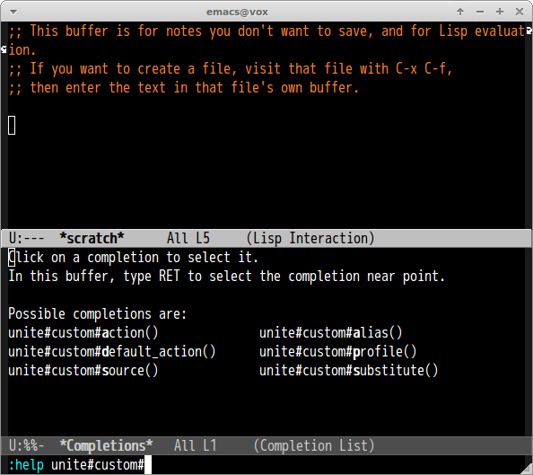
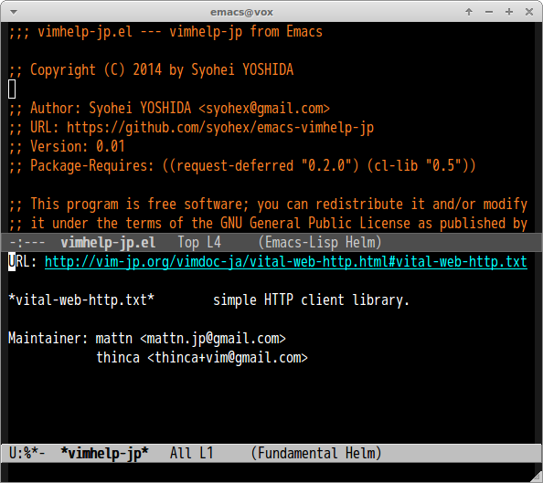

# vimhelp-jp.el

## Introduction
`vimhelp-jp.el` is Emacs frontend of [vim-help-jp](http://vim-help-jp.herokuapp.com/)

## Requirements

* Emacs 24 or higher
* [request-deferred](https://github.com/tkf/emacs-request)

## Basic Usage

#### `vimhelp-jp`

Search query from [http://vim-help-jp.herokuapp.com/](http://vim-help-jp.herokuapp.com/)
